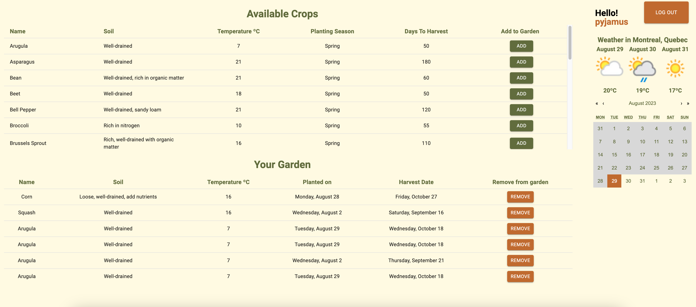

# FinalProject-GardenHero

  

 

# Tech Stack

This CRUD app uses React, NodeJS, Express and MongoDB

# Features

- Predictive Search Bar
- Auth0 middleware
- RESTful Api

# Future improvements and optimizations

- Create swagger api documentation

# Setup

### The Frontend

1. Open a terminal in VS Code
2. Type `cd frontend`
3. Type `yarn install`

Use `yarn dev:frontend` to start the frontend dev environment.

### The Backend

1. Open _another_ terminal in VS Code
2. Type `cd backend`
3. Type `yarn install`

Use `yarn dev:backend` to start the backend dev environment.

---

## The App

### Homepage:

The landing page. Users can search available crops and also log into the app to get access to the planner page.

  

### CropDetails:

CropDetails shows a more detail view of the selected crop.

  

### Login:

The login page. Handled by Auth0.

### Planner:

The main application that allows you to add crops to your garden. It displays the day you planted and harvest date for each crop you add.

  
